# MLP Optimizer Comparison — MNIST

——***yang-lab-sketch***

> 项目：基于不同一阶优化算法的多层感知机训练与对比研究  
> 实现：Python + NumPy（手写前向/反向传播，无深度学习框架）

---

## 一、项目简介

本项目使用 **NumPy 手撸一个两层 MLP**，在 MNIST 数据集上分别使用 SGD、Momentum、Adam 等优化器进行训练，对比其损失曲线及测试集准确率。

---

## 二、项目结构
```
mlp-optimizer-comparison/
├── data/
│   └── load_mnist.py          # 自动下载并加载 MNIST（sklearn）
├── models/
│   └── mlp.py                 # MLP 前向 / 反向传播（矩阵形式）
├── optimizers/
│   ├── base.py                # Optimizer 基类
│   ├── sgd.py
│   ├── momentum.py
│   └── adam.py
├── losses/
│   └── cross_entropy.py       # Softmax + Cross Entropy + 梯度
├── utils/
│   ├── metrics.py             # accuracy 计算
│   └── plot.py                # loss / accuracy 曲线绘制
├── experiments/
│   └── train_mnist.py         # 训练 + 测试入口
├── results/                   # 实验曲线、日志
├── requirements.txt
└── README.md
```

---

## 三、环境依赖

- python==3.10
- numpy==1.24.4
- scikit-learn==1.7.2
- matplotlib>=3.7
- scipy>=1.10

---

## 四、项目详情

### （1）数据集选用

基于项目的核心目标是为了对比不同mlp优化器针对同一个数据集的优化效果，我采用了一个相对简易的数据集，即**sklearn库中的mnist手写数字数据集**，该数据集是一个(70000,784)的样本集，其中784=28*28

```py
X, y = fetch_openml(
        'mnist_784',
        version=1,
        return_X_y=True,
        as_frame=False
    )
```

我对于数据集的处理主要基于三个方面：
- 像素归一化：防止softmax函数出现一些数值溢出的问题，或者在权重更新的时候梯度被天然放大等一系列问题

```py
if normalize:
        X = X / 255.0
```

- 数字标签从字符串转化成整数，方便参与数值运算

```py
y = y.astype(int)
```

- 随机划分训练集和测试集：随机化索引（原数据集按类别排序）+ 设置划分比例（训练：测试 = 8：2）

```py
def load_mnist(normalize=True, flatten=True, test_size=0.2, random_state=42):
```

```py
    n_samples = X.shape[0]
    indices = np.random.permutation(n_samples)

    test_count = int(n_samples * test_size)
    test_idx = indices[:test_count]
    train_idx = indices[test_count:]

    X_train, X_test = X[train_idx], X[test_idx]
    y_train, y_test = y[train_idx], y[test_idx]

    return X_train, X_test, y_train, y_test

```

### （2）基本mlp结构构建

可以对应mlp.py这份代码及其注释，以下提供核心部分代码及注释

- 前向传播：
$$
\begin{aligned}
Z^{(1)} &= X W^{(1)} + b^{(1)} \\[4pt]
A^{(1)} &= \max(0,\; Z^{(1)}) \\[4pt]
Z^{(2)} &= A^{(1)} W^{(2)} + b^{(2)} \\[4pt]
\hat{y} &= \text{softmax}(Z^{(2)})
\end{aligned}
$$

- 交叉熵损失：
$$
L = -\frac{1}{N} \sum_{i=1}^{N} \log \hat{y}_{i,\,y_i}
$$

- 反向传播
$$
\begin{aligned}
\frac{\partial L}{\partial Z^{(2)}} &= \frac{1}{N}\big(\hat{y} - \mathbf{1}_y\big) \\[6pt]
\frac{\partial L}{\partial W^{(2)}} &= {A^{(1)}}^\top \frac{\partial L}{\partial Z^{(2)}},\quad
\frac{\partial L}{\partial b^{(2)}} = \sum_i \frac{\partial L}{\partial Z^{(2)}}_i \\[6pt]
\frac{\partial L}{\partial A^{(1)}} &= \frac{\partial L}{\partial Z^{(2)}}{(W^{(2)})}^\top \\[6pt]
\frac{\partial L}{\partial W^{(1)}} &= X^\top \Big( \frac{\partial L}{\partial A^{(1)}} \odot \mathbb{1}(Z^{(1)}>0) \Big),\quad
\frac{\partial L}{\partial b^{(1)}} = \sum_i \Big( \frac{\partial L}{\partial A^{(1)}}_i \odot \mathbb{1}(Z^{(1)}>0)_i \Big)
\end{aligned}
$$

### （3）优化器

优化器本质上在解决一个问题，怎么优化反向传播计算得到的梯度，并更新参数，让loss往小的方向走

- SGD随机梯度下降：
\[
\theta_{t+1} = \theta_t - \eta \, g_t
\]

其中 $g_t = \dfrac{\partial L}{\partial \theta_t}$，$\eta$ 为学习率

- momentum动量法：
\[
\begin{aligned}
v_t &= \beta v_{t-1} + (1 - \beta)\, g_t \\[4pt]
\theta_{t+1} &= \theta_t - \eta \, v_t
\end{aligned}
\]

  其中 $v_t$ 为速度（累积梯度方向），$\beta \in [0,1)$ 通常为 $0.9$
  理论分析：从损失函数等高线图角度来看，同心椭圆沿着长轴方向梯度平缓（等高线稀疏），沿着短轴方向梯度急剧（等高线密集），动量法改变了sgd一个方向走到底的策略，而是作了方向的拆分，理论上由于sgd

- Adam
\[
\begin{aligned}
m_t &= \beta_1 m_{t-1} + (1 - \beta_1)\, g_t \\[4pt]
v_t &= \beta_2 v_{t-1} + (1 - \beta_2)\, g_t^2 \\[4pt]
\hat{m}_t &= \dfrac{m_t}{1 - \beta_1^t}, \quad
\hat{v}_t = \dfrac{v_t}{1 - \beta_2^t} \\[4pt]
\theta_{t+1} &= \theta_t -
\eta \,\frac{\hat{m}_t}{\sqrt{\hat{v}_t} + \varepsilon}
\end{aligned}
\]

  通常取 $\beta_1 = 0.9,\; \beta_2 = 0.999,\; \varepsilon = 10^{-8}$
  既保留惯性加速与振荡抑制，又对不同参数自动调整步长，是对 SGD → Momentum 的系统改进。

---

## 五、实验结果

- **SGD**
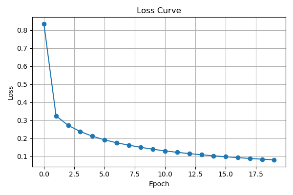

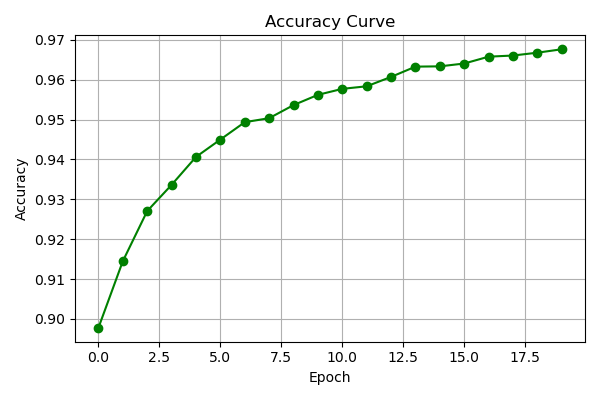

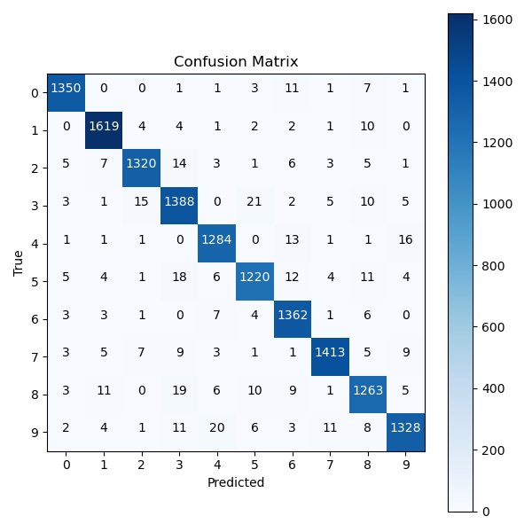

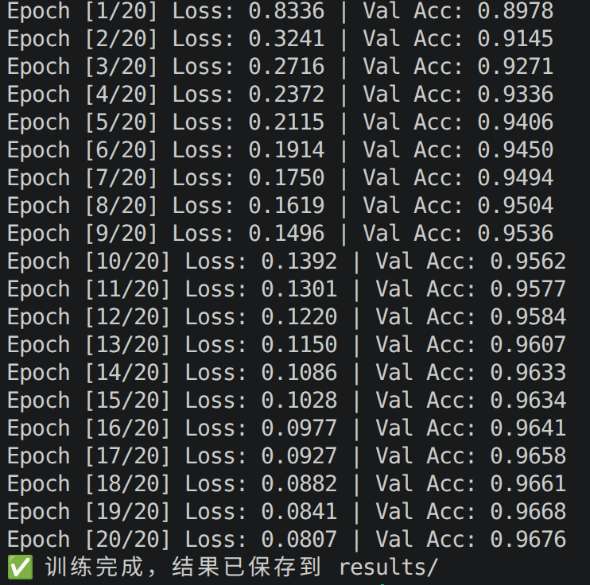

- **momentum**
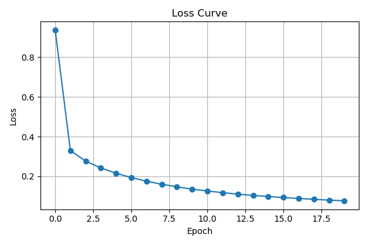

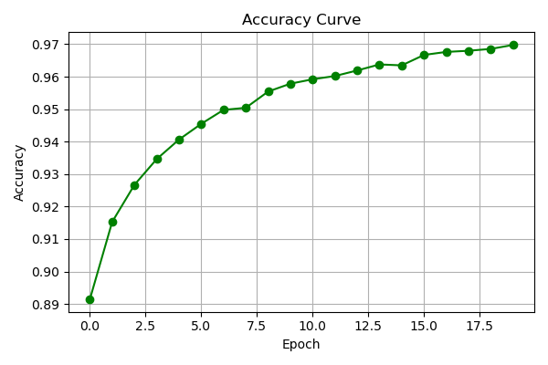

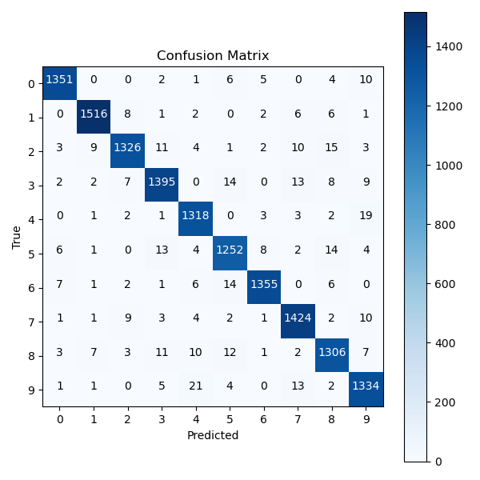

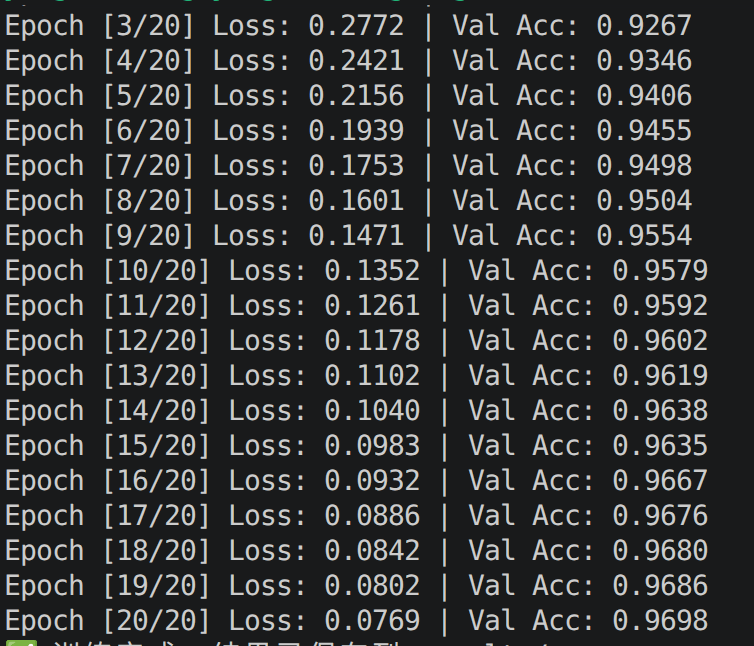

- **adam**
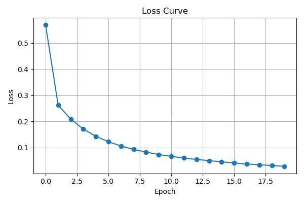

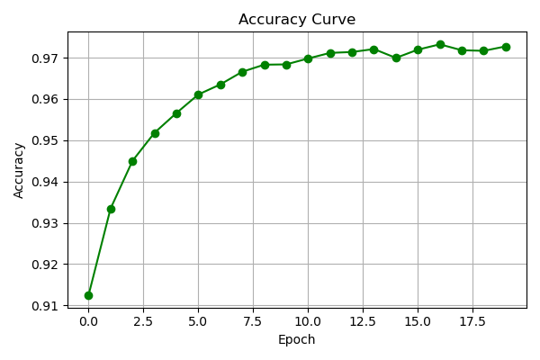

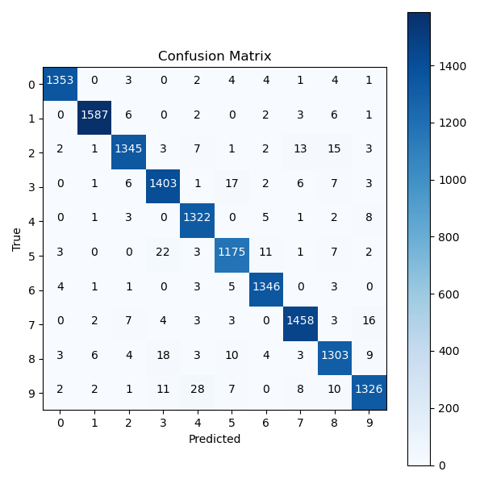

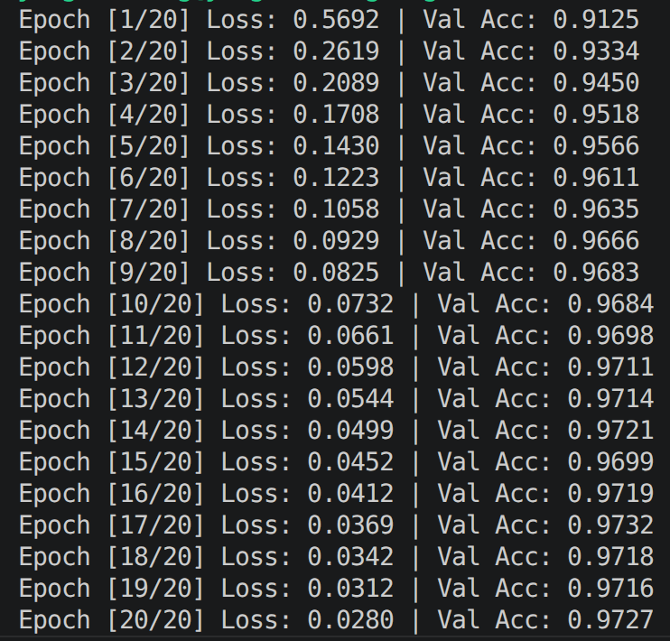

---

## 六、实验结论

**从详细数据来看，loss：adam < momentum < sgd，acc：adam > momentum > sgd**